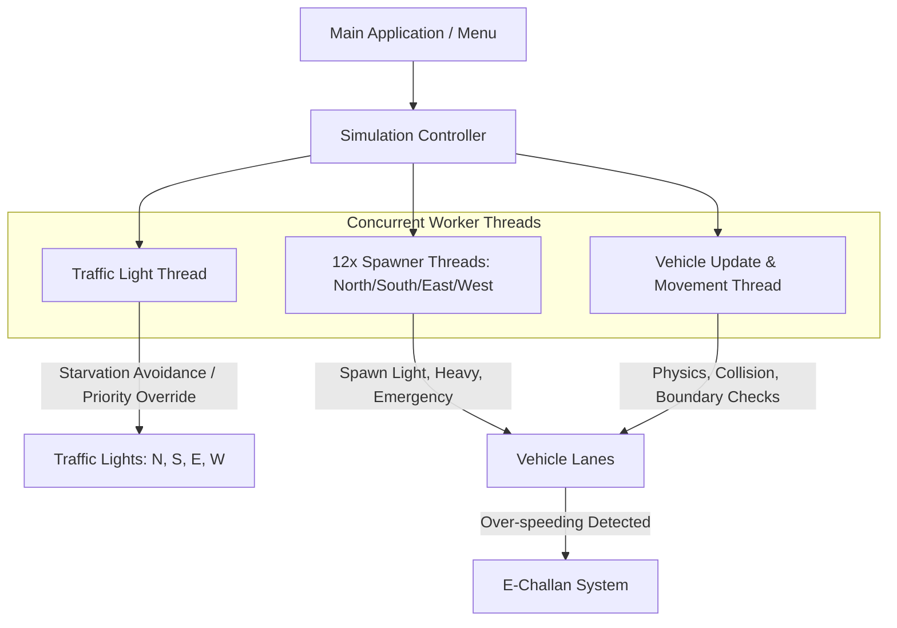

# 🚦 Smart Multithreaded Traffic Simulation & Management System

An interactive, real-time 4-way intersection traffic management and simulation system built with **C++** and **SFML (Simple and Fast Multimedia Library)**, demonstrating core **Operating Systems (OS)** concurrency concepts, dynamic scheduling, and emergency preemption.

---

## 📋 Table of Contents
- [Overview](#-overview)
- [Demo Video](#-demo-video)
- [Key Features](#-key-features)
- [Operating Systems Concepts Implemented](#-operating-systems-concepts-implemented)
- [Vehicle Hierarchy & Classes](#-vehicle-hierarchy--classes)
- [System Architecture](#-system-architecture)
- [Project Structure](#-project-structure)
- [Prerequisites & Dependencies](#-prerequisites--dependencies)
- [Setup & Build Instructions](#-setup--build-instructions)
- [How to Use & Controls](#-how-to-use--controls)
- [Contributors](#-contributors)

---

## 🌟 Overview

Urban traffic bottlenecks and emergency delays present major logistics and safety challenges. This project simulates a 4-way crossroad intersection (North, South, East, West) with autonomous vehicle generation, intelligent traffic signals, speed violation detection, and high-priority emergency preemption.

The system is constructed to model real-world operating systems mechanisms, including concurrent thread execution, race condition avoidance, starvation prevention, and priority-based interrupt handling.

---

## ✨ Key Features

1. **Autonomous 4-Way Intersection Simulation**:
   - Manages four bidirectional approach lanes with realistic spatial boundaries and visual rendering.
   - Smooth traffic light state transitions (`Green` 🟢 $\to$ `Yellow` 🟡 $\to$ `Red` 🔴).

2. **Multithreaded Concurrent Execution**:
   - Separate asynchronous worker threads for traffic light scheduling, vehicle movement/collision handling, and direction-specific vehicle spawning.

3. **Dynamic Starvation-Avoidance Signal Scheduling**:
   - Traffic lights dynamically monitor road occurrence frequencies and prioritize least-served directions to prevent deadlocks and lane starvation.

4. **Emergency Vehicle Priority Preemption (Interrupt Handling)**:
   - When an emergency vehicle (Ambulance, Police Car, Fire Truck) is detected in any lane, normal cycle scheduling is preempted immediately.
   - The emergency lane is granted an instant green light while all other lanes are switched to red until the emergency vehicle safely passes.

5. **Automated Speed Violation & E-Challan System**:
   - Automatically tracks vehicle speeds based on category limits:
     - **Light Vehicles**: Speed threshold of 60 km/h.
     - **Heavy Vehicles**: Speed threshold of 40 km/h.
   - Flags violating vehicles and issues electronic challans (tickets) linked to their unique license IDs.

6. **Interactive GUI & Challan Inquiry Portal**:
   - Features an interactive menu to launch the simulation or query/pay traffic violation challans by entering vehicle license numbers.

---

## 🧠 Operating Systems Concepts Implemented

| OS Concept | Implementation in Simulation |
| :--- | :--- |
| **Multithreading** | Utilizes C++ `std::thread` to run 14+ concurrent threads (Traffic light controller, Physics/Update thread, and 12 dedicated vehicle spawner threads). |
| **Mutual Exclusion & Concurrency** | Synchronized state management between vehicle lists and traffic signal controllers (`std::mutex`, atomic flags). |
| **Priority Scheduling & Preemption** | Emergency vehicles act as high-priority hardware interrupts, immediately preempting lower-priority scheduled tasks (standard traffic cycle). |
| **Fair Scheduling / Starvation Prevention** | Dynamic round-robin algorithm that monitors road service counters (`*LightOccurance`) to prevent any single direction from starving. |
| **Real-time Event Handling** | Periodic clock polling and frame synchronization using `sf::Clock` and `std::chrono`. |

---

## 🚗 Vehicle Hierarchy & Classes

Built using Object-Oriented Programming (OOP) with an abstract base class and polymorphic behavior:

```
                  ┌───────────────────────┐
                  │    Vehicle (Base)     │
                  │  - License Number     │
                  │  - Speed, Coordinates │
                  │  - Challan Status     │
                  │  - SFML Sprite/Texture│
                  └───────────┬───────────┘
                              │
         ┌────────────────────┼────────────────────┐
         │                    │                    │
┌────────┴────────┐  ┌────────┴────────┐  ┌────────┴────────┐
│  LightVehicle   │  │  HeavyVehicle   │  │ EmergencyVehicle│
│ - Speed: 1-60   │  │ - Speed: 1-40   │  │ - Speed: 1-80   │
│ - Cars, Bikes   │  │ - Buses, Trucks │  │ - Ambulance,    │
│ - Challan > 60  │  │ - Challan > 40  │  │   Police, Fire  │
│                 │  │                 │  │ - High Priority │
└─────────────────┘  └─────────────────┘  └─────────────────┘
```

---

## 🏗 System Architecture



---

## 📁 Project Structure

```
.
├── assets/                     # Graphical assets (textures, sprites, fonts)
│   ├── new/                    # Active simulation textures (cars, bikes, trucks, ambulance, background)
│   │   ├── Arial.ttf           # Font file for GUI text
│   │   ├── ambulance.jpg       # Emergency ambulance texture
│   │   ├── background.jpg      # Menu background
│   │   ├── background4.png     # Intersection map background
│   │   ├── bike.png            # Light vehicle texture
│   │   ├── bus.png             # Heavy vehicle texture
│   │   ├── car.png             # Light vehicle texture
│   │   ├── police_car.png      # Emergency police car texture
│   │   └── truck.png           # Heavy vehicle texture
├── SFML/                       # SFML 2.5.1 C++ library (headers & static libs)
├── Source.cpp                  # Complete source code containing Simulation, Threads, and GUI
├── OS Project.sln              # Visual Studio Solution file
├── OS Project.vcxproj          # Visual Studio Project configuration
├── .gitignore                  # Git ignore rules for build files and VS caches
└── README.md                   # Project documentation
```

---

## ⚙️ Prerequisites & Dependencies

- **Operating System**: Windows 10 / 11
- **IDE / Compiler**: Visual Studio 2019 or 2022 (with *Desktop development with C++* workload)
- **C++ Standard**: C++14 or C++17
- **Graphics Library**: [SFML 2.5.1 (32-bit or 64-bit to match build target)](https://www.sfml-dev.org/)

---

## 🚀 Setup & Build Instructions

### Option 1: Using Visual Studio (Recommended)

1. **Clone the repository**:
   ```bash
   git clone https://github.com/<your-username>/<your-repo-name>.git
   cd <your-repo-name>
   ```

2. **Open the Solution**:
   - Double-click `OS Project.sln` to open the project in Visual Studio.

3. **Configure SFML paths (if not using project-relative paths)**:
   - Right-click the project in Solution Explorer $\to$ **Properties**.
   - Under **C/C++ $\to$ General $\to$ Additional Include Directories**, ensure `SFML/include` or your local SFML include directory is linked.
   - Under **Linker $\to$ General $\to$ Additional Library Directories**, ensure `SFML/lib` or your local SFML lib directory is linked.
   - Under **Linker $\to$ Input $\to$ Additional Dependencies**, ensure the following are included:
     - **Debug**: `sfml-graphics-d.lib;sfml-window-d.lib;sfml-system-d.lib;`
     - **Release**: `sfml-graphics.lib;sfml-window.lib;sfml-system.lib;`

4. **Verify DLLs**:
   - Ensure the required SFML DLLs (`sfml-graphics-2.dll`, `sfml-window-2.dll`, `sfml-system-2.dll`, `openal32.dll`, etc.) are in the root executable directory.

5. **Build and Run**:
   - Select **Debug** or **Release** with target platform **x64** (or **Win32** matching your configuration).
   - Press **F5** or click **Local Windows Debugger** to run.

---

## 🎮 How to Use & Controls

When the application starts, the **Traffic Simulation Menu** is displayed:

| Key / Action | Function | Description |
| :---: | :--- | :--- |
| <kbd>1</kbd> | **Run Simulation** | Launches the real-time 4-way intersection simulation window with all concurrent threads running. |
| <kbd>2</kbd> | **Pay / Query Challan** | Opens the Challan portal. Enter a vehicle license number using numeric keys and press <kbd>Enter</kbd> to inspect speed violation records. |
| <kbd>Close [X]</kbd> | **Exit** | Closes the active simulation or window, cleanly terminating all background worker threads. |

---

## 🎥 Demo Video

Watch the real-time simulation and multithreaded traffic control in action:

▶️ **[Click here to Watch the Project Demo Video](https://drive.google.com/file/d/1h8D_bzM5n70SrQJYkOHj01dvNStrByiz/view?usp=drive_link)**

---

## 👥 Contributors

- **Operating Systems Course Project**
- Developed by Daniyal and Project Team.
